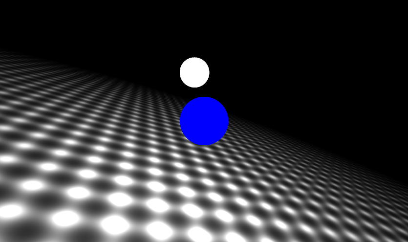
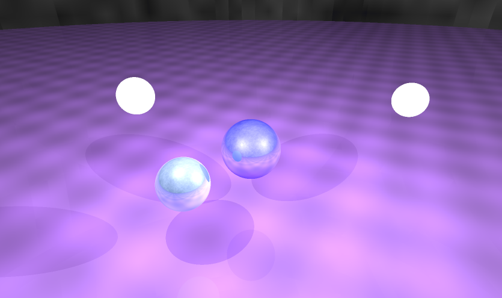
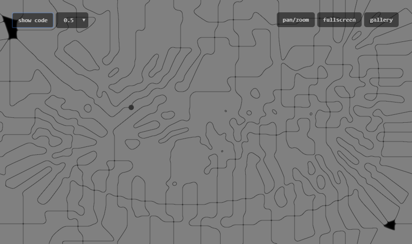
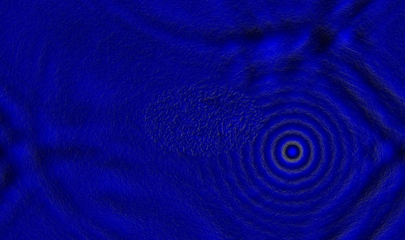
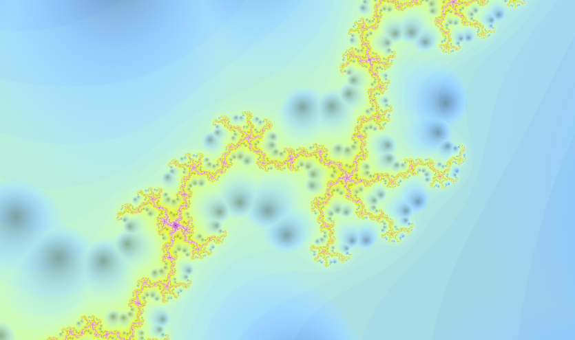
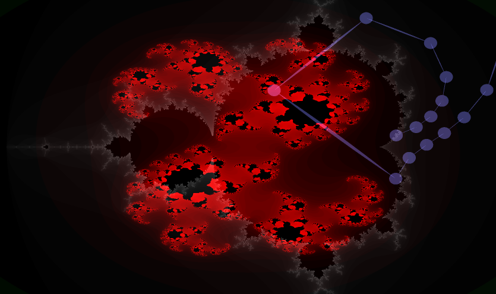
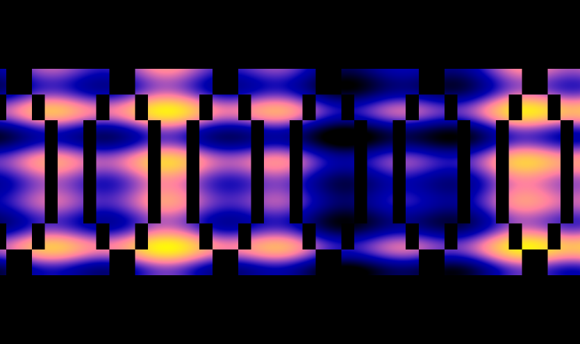

# glslsandbox

My creations on the fantastic [GLSL Sandbox](http://glslsandbox.com) by [mrdoob](https://mrdoob.com) (this site is not moderated so you will find good, bad and ugly things there). Coding in [GLSL](https://en.wikipedia.org/wiki/OpenGL_Shading_Language) in the browser thanks to [WebGL](https://en.wikipedia.org/wiki/WebGL) is just pure recreation and mathematical art!

The principle is simple: write a `main` function setting the color of each pixel on the screen given its coordinates. Because the calls to the `main` function are done in parallel, no data can be stored or shared between the calls.

The variables are defined as:

- `gl_FragCoord`: vector of 2 integers containing the pixel coordinates
- `gl_FragColor`: vector of 4 floats containing the RGBA components of the color to compute
- `resolution`: size in pixels of the rendered rectangle
- `time`: time (in seconds?) since reload/modification of the page
- `mouse`: virtual position of the mouse pointer inside the rendered rectangle (between 0 and 1)
- `backbuffer`: 2D texture containing the previously rendered frame (type `sampler2D`)

Check as well the superb but heavy [Shadertoy](https://www.shadertoy.com/) by [iq](http://iquilezles.org/index.html) for similar, more complex shaders (with input data).

## [Ray-traced checker](https://glslsandbox.com/e#75356.0)

Basic calculation of a ray-tracer with mouse-controlled rotations:

## [Ray-traced balls, sky and checker with lighting and reflections](https://glslsandbox.com/e#75360.1)

Full ray-tracer with recursive reflections and lighting based on the [Phong reflection model](https://en.wikipedia.org/wiki/Phong_reflection_model):

It only supports 4 kinds of objects: checker, sky drawn wih [Perlin noise](https://en.wikipedia.org/wiki/Perlin_noise), light and mirror-ball.

## [Diverging wave propagation](https://glslsandbox.com/e#75357.2)

This is my first attempt at simulating the wave equation but with an inappropriate propagation speed, such that the computation is not stable:

The result is interesting: it processes the current picture, including the circles drawn under the mouse pointer, into slowly moving lines.

It is difficult to explain what happens there, give it a try!

## [Wave propagation with water-like reflections](https://glslsandbox.com/e#75361.0)

Simulation of the [wave equation](https://en.wikipedia.org/wiki/Wave_equation) on two medias with different speeds (slower in the ellipse at the center of the rendered rectangle):

The computation principle is comparable to the [explicit finite-difference method](https://en.wikipedia.org/wiki/Finite_difference_method).

A fake lighting is computed with the mouse pointer as light source.

## [Mandelbrot with rotation, zoom and orbit trapping](https://glslsandbox.com/e#75359.1)

Classical [Mandelbrot set](https://en.wikipedia.org/wiki/Mandelbrot_set) with wide-range zoom and rotation:

The fractal is rendered with [circular orbit traps](https://en.wikipedia.org/wiki/Orbit_trap).

## [Mandelbrot and Julia sets with sequence of points](https://glslsandbox.com/e#75355.0)

Superposition of a Julia set on top of the Mandelbrot set, where the reference point on the Julia set corresponds to the position of the mouse pointer on the Mandelbrot set:

The dots represent the sequence of complex numbers used in the iterations on the Mandelbrot set at the mouse pointer position.

This shader is very useful to understand how the computation evolves in different areas of the Mandelbrot set. Give it a try!

## [Character font](https://glslsandbox.com/e#75358.0)

Skeleton implementation of the display of a character string (only the character "O" is implemented):

The code is particularly strange here.
